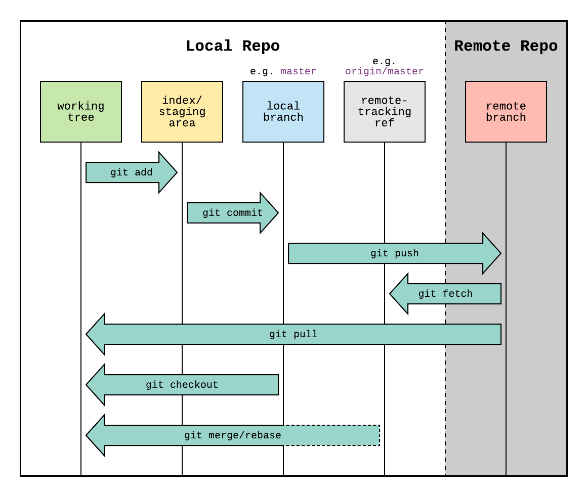

  

# Resumo Teórico

  

  

## O que é git?

  

Sistema distribuido de controle de versão (VCS) que ajuda desenvolvedores acompanhar seus repositórios, colaborar com outras pessoas e organizar multiplas versões de um projeto.

  

## O que é GitHub?

  

Plataforma baseada em web que é usada para controle de versão e colaboração. Ele hospeda repositórios e providência uma interface para gerenciar seu código. Desse modo, sendo capaz de auxilar na elaboração de projetos open-source com contribuições vindas de todo mundo e se inserir em todo tipo de atividade sendo simples ou complexa, fechada ou aberta.

  
### Funções: 
- bug tracking
Uso do sitema *GitHub Issues* para rastrear erros, tarefas, ideias e feedback

- feature requests
Trata-se do conceito de propor novas funcionalidades ou melhorias para um produto, sendo essas solicitações geralmente realizadas por usuários, clientes ou pela própria equipe.

- task management
É o uso de ferramentas do GitHub, como Issues e Projects, para organizar tarefas, acompanhar progresso e manter registro do seus trabalhos.

- wikis
É uma funcionalidade já do github que permite os usuários hospedarem e gerenciarem as documentações para os seus repositórios.
  

## Documentação do GIT

https://git-scm.com/docs/git/pt_BR

  

## Cheat Sheet do GIT

https://git-scm.com/cheat-sheet

  

## Cheat Sheet Markdown

https://www.markdownguide.org/cheat-sheet/

## Site que resume bem como o GIT funciona

https://kodekloud.com/blog/how-git-works/

## GIT Workflow

  

### Local machine (working directory)

- Working directory

O diretório onde os projetos estão.
Os arquivos novos são consideradas *untracked* até colocá-las na área de *stage*.
    
- Staging area
Arquivos aqui estão para serem incluídos no proximo *commit*.

- local repo
>.git diretório
Container para o sistema de controle de versão. Possui metadados, database de objetos e informações da configuração. 
  

Remote

- remote repo
São hubs centralizados que os membros podem pegar e colocar mudanças de forma sincronizada e colaborativa.

### Vídeo para auxiliar a entender:
https://www.youtube.com/watch?v=e9lnsKot_SQ

# Reflexão

  

## O que é desenvolvimento profissional?

Desenvolvimento profissional é a constante melhoria do profissional em seu cargo. Ele está relacionado tanto as habilidades técnicas (hard skills) quanto as habilidades comportamentais, socioemocionais e cognitivas (soft skills). Desse modo, ele engloba a capacidade do profissional de evoluir e de se adaptar a novos ambientes e desafios. Neste contexto, recentemente, o avanço da IA fez com que profissionais das mais diversas áreas aprender a utilizá-la da melhor forma.