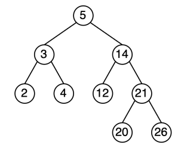

# README aprendizados python.

# Introdução :

Ao longo destas 3 semanas foram passados exercícios que testavam meu conhecimento em diversas áreas da programação utilizando python. Foi muito interessante ver o aumento na dificuldade dos problemas, pois, no início eu conseguia fazer de forma rápida e apenas com a bagagem que já tinha, mas conforme os exercícios foram passando vi a necessidade de ir atrás de videoaulas, leituras e etc para aprender o que era necessário para a resolução da questão.

---

# Dividir para conquistar e Lógica de programação :

No primeiro problem set treinei minha lógica de programação em um paradigma mais estruturado, seguindo um fluxo 100% linear, entretanto, ao lidar com o segundo me deparei com uma prática que eu estava aprimorando recentemente, o método de **dividir para conquistar**, o qual será utilizado para todos os seguintes exercícios . 

Este método é de extrema utilidade quando você se depara com um desafio complexo e que tem muitos passos, pois a partir dele é possível repartir essas diferentes etapas em funções específicas. Assim, ao invés de fazer um sistema extremamente linear, dessa forma as funções interagem entre si, resolvendo cada passo simples por vez e no final nos retorna a solução para o problema complexo passado

---

# TF-IDF :

No problem set 3 me deparei com um conceito novo p **TD-IDF**, uma técnica estatística que serve para avaliar o quão relevante uma palavra é dentro de um documento em relação a uma coleção de documentos.

Exemplo : se estamos analisando documentos que abordem notícias automobilísticas, as palavras “o” , “a” , que aparecem com muita constância , são basicamente irrelevantes, apenas palavras para “compor a sintaxe”, porém palavras como o modelo do carro, que são mais raras, serão mais relevantes.

## TF ( Term-Frequency ) :

O **TF** mede a frequência mede a frequência com que uma palavra palavra aparece em um documento específico.

### Fórmula para calcular o TF :

$TF(t, d) = \frac{\text{Número de vezes que o termo } t \text{ aparece no documento } d}{\text{Total de termos no documento } d}$

Identifica os temas principais de um arquivo.

## IDF (Inverse Document Frequency ) :

O **IDF** mede o quão comum uma palavra é em todo o conjunto de arquivos. Palavras como "que", "de" ou "um" aparecem em quase todos os documentos, portanto, possuem pouco importância para a análise. Já palavras técnicas ou nomes próprios aparecem em poucos textos e possuem maior relevância.

### Fórmula para calcular o IDF :

$IDF(t, D) = \log \left( \frac{\text{Total de documentos } N}{\text{Número de documentos que contêm o termo } t} \right)$

Penaliza palavras muito comuns e da mais peso para palavras raras e significativas.

## TF-IDF :

O **TF-IDF** é o produto dos dois valores anteriores.

### Fórmula para calcular o TF-IDF :

$TF\text{-}IDF = TF \times IDF$

Um valor **alto** ocorre quando a palavra aparece muito em um documento, mas raramente no restante da coleção.

Um valor **baixo** ocorre quando a palavra aparece pouco no documento ou aparece em praticamente todos os textos da base.

---

# Árvore binária :

No problem set 4 me deparei com o conceito mais desafiador da atividade, a árvore binária.

Uma estrutura de dados que funciona a partir de nós pais e filhos que vão se ramificando a partir de uma raiz ( primeiro nó ) até chegar em uma folha ( nó que não possui filho ) .
<br>

<br>

## Altura de uma árvore :

Para analisar a altura de uma árvore podemos assumir a quantidade de arestas ou a quantidade de nós, nesse exercício foi solicitado a quantidade arestas ( nós - 1 ) .

Em python uma árvore é contruída através de uma classe Nó , a qual para cada nó passamos seu filho esquerdo e direito :

Ex → `tr3 = Node(5, Node(1), Node(5, Node(5)))`

- Para acessar o **valor** do nó utilizamos o método → `object.get_value()`
- Para acessar o **filho direito** utilizamos o método → `object.get_right_child()`
- Para acessar o **filho esquerdo** utilizamos o método → `object.get_left_child()`

### Algoritmo para calcular a altura da árvore :
<br>

```python
def find_tree_height(tree):

    if tree is None:
        return -1

    else:
        left = find_tree_height(tree.get_left_child())
        right = find_tree_height(tree.get_right_child())

    return 1 + max(left, right)
```
<br>

- Explicação :

1. Entra a árvore na função ( objeto )
2. Verifica se a árvore é vazia
3. Se não, cria uma variável para o filho esquerdo e direito , e chama ambas recursivamente novamente para a função “find_tree_height”.
4. Quando atinge o caso base ( tree is None ) retorna -1
5. E a pilha recursiva “volta” fazendo o cálculo do máximo entre direita e esquerda e adicionando 1 a altura.

## Heap :

*Existem 2 tipos de heaps :*

- ***Min heap*** → O valor do nó filho é sempre **maior** que o do nó pai
- ***Max heap*** → O valor do nó filho é sempre **menor** que o do nó pai

### Algoritmo para verificar se uma árvore é heap :

<br>

```python
def is_heap(tree, compare_func):


    if tree is None or (tree.get_left_child() is None and tree.get_right_child() is None):
        return True

    if tree.get_left_child():
        if not compare_func(tree.get_left_child().get_value(), tree.get_value()):
            return False
        if not is_heap(tree.get_left_child(), compare_func):
            return False

    if tree.get_right_child():
        if not compare_func(tree.get_right_child().get_value(), tree.get_value()):
            return False
        if not is_heap(tree.get_right_child(), compare_func):
            return False
        
    return True
```

<br>


